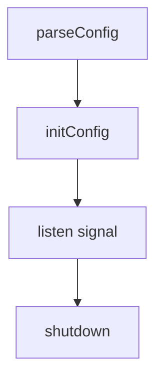

# 流程

go build \
-ldflags " \
-X 'main.BuildVersion=${build_version}' \
-X 'main.BuildGoVersion=${go_version}' \
-X 'main.BuildTime=${build_time}' \
-X 'main.BuildCommit=${build_commit}' \
-o ${APP_NAME}
" main.go
————————————————
版权声明：本文为CSDN博主「merlin.feng」的原创文章，遵循CC 4.0 BY-SA版权协议，转载请附上原文出处链接及本声明。
原文链接：https://blog.csdn.net/Merlin_feng/article/details/127991059